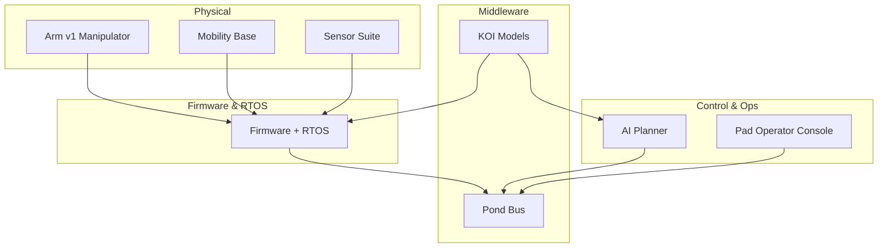

This section will become the single source of truth for hard facts:

* Mechanical and electrical specifications (e.g. [Arm v1 spec](/notes/arm)).
* KOI model file formats and inference APIs.
* Pond bus topic schemas.
* Command-line flags for the **Pad** operator console.

Expect lots of tables, type definitions, and versioned changelogs.

## System overview

<Columns cols={3}>
  <Card title="Hardware" icon="robot" href="/reference/hardware">
    Power, buses, and safety loop.
  </Card>

  <Card title="Software" icon="code" href="/reference/software">
    From firmware to AI planners.
  </Card>

  <Card title="Firmware" icon="microchip" href="/reference/firmware">
    Embedded systems for modular components.
  </Card>
</Columns>