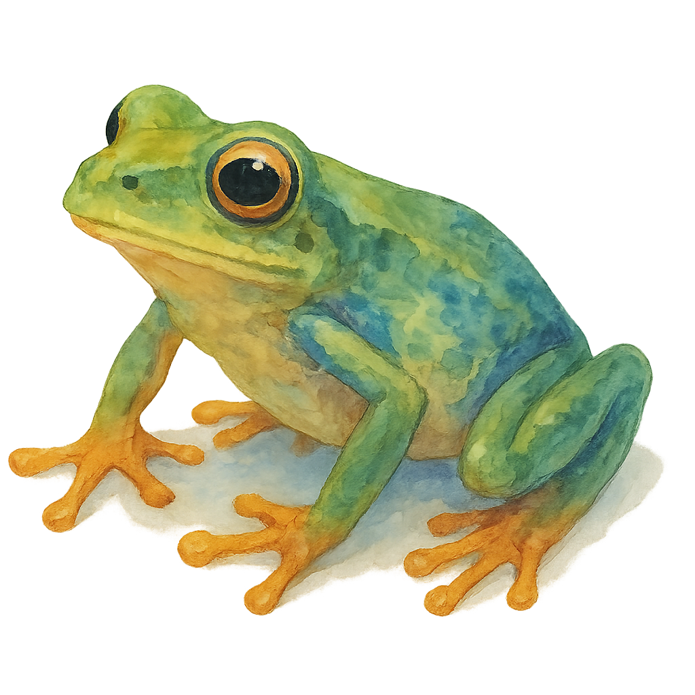

  
  <h1 className="text-2xl font-bold">DIY Autonomous Robots</h1>

  <Columns cols={2}>
    <Card title="Quickstart" icon="rocket" href="/guides/quickstart">
      Start building your robot.
    </Card>

    <Card title="Core Concepts" icon="book" href="/reference/index">
      Learn about Pond's architecture.
    </Card>

    <Card title="Join the Community" icon="message" href="https://github.com/ecto/pond/discussions" arrow="true">
      Chat with the community on GitHub Discussions.
    </Card>

    <Card title="Star on GitHub" icon="github" href="https://github.com/ecto/pond" arrow="true">
      Show your support by starring our repo.
    </Card>
  </Columns>

