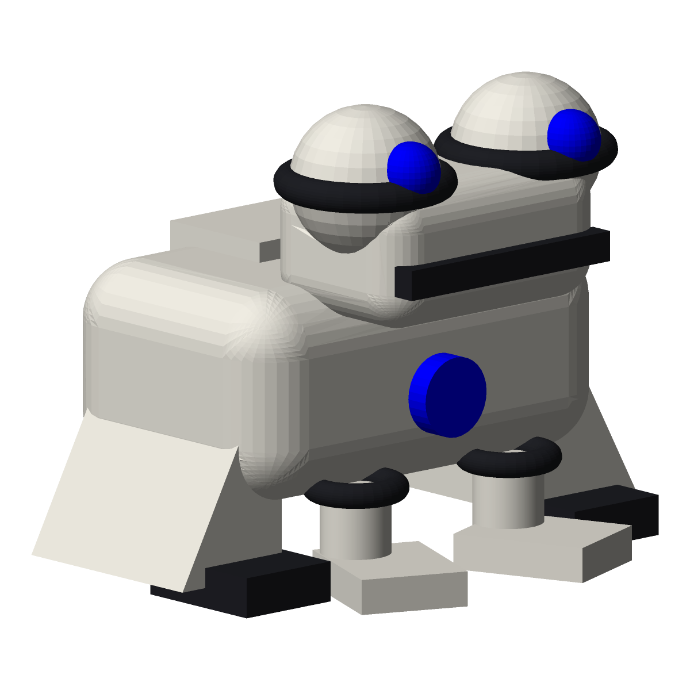
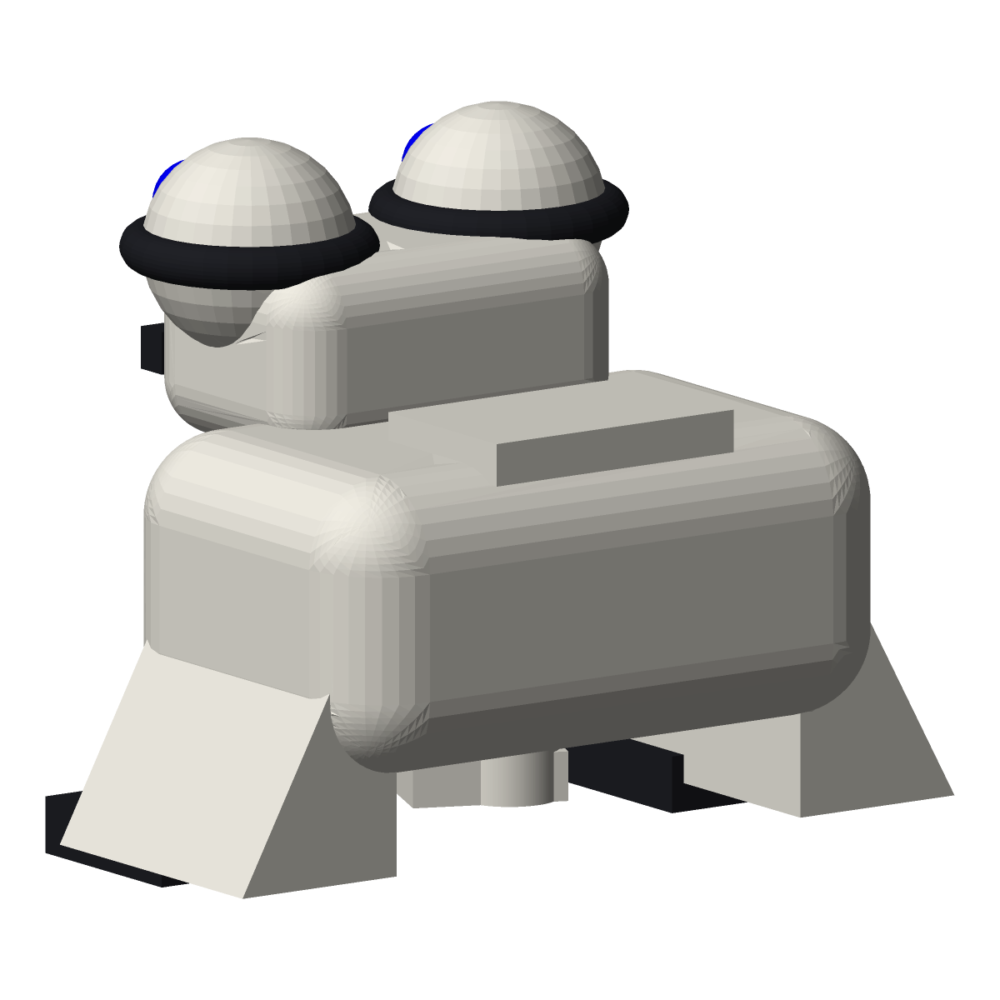

  

    
<a className="landing-mark" href="/" aria-label="Pond">

</a>

    <section className="landing-hero">
      {/* <a className="landing-chip" href="/start/showcase">
        <strong>Early days</strong>·See the showcase→
      </a> */}

      <h1>Build a thinking robot</h1>
      

        Machines that think, move, and live alongside us.
        Everything you need to bring one to life in your garage.
      

      

        <a className="landing-btn landing-btn-primary" href="/guides/quickstart">Start</a>
        <a className="landing-btn landing-btn-ghost" href="/start/introduction">Why</a>
      

    </section>

    
    
    
    
  

