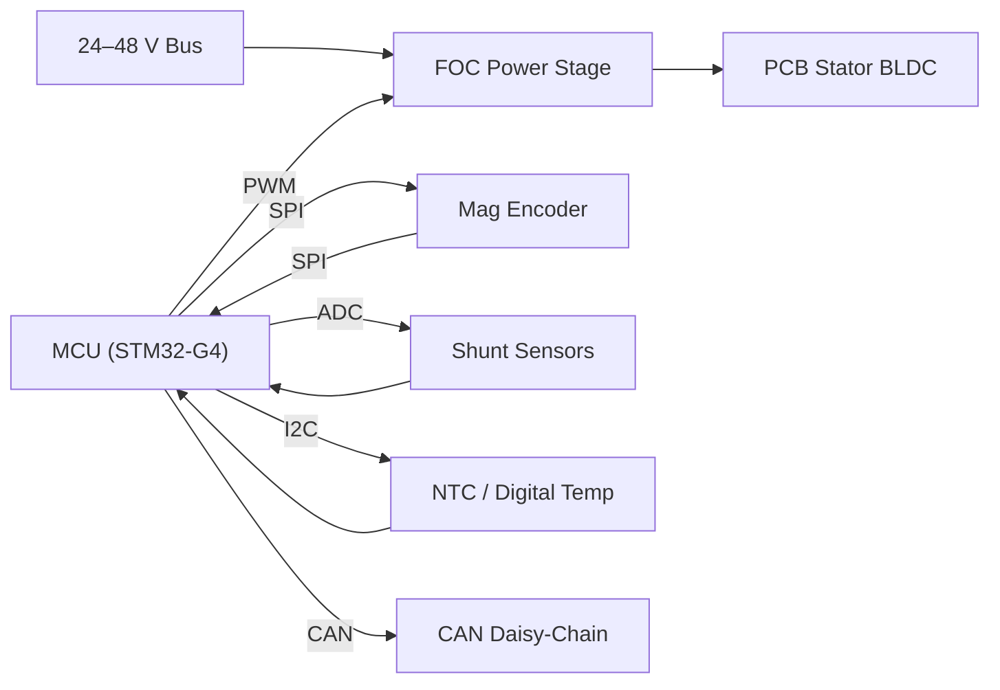
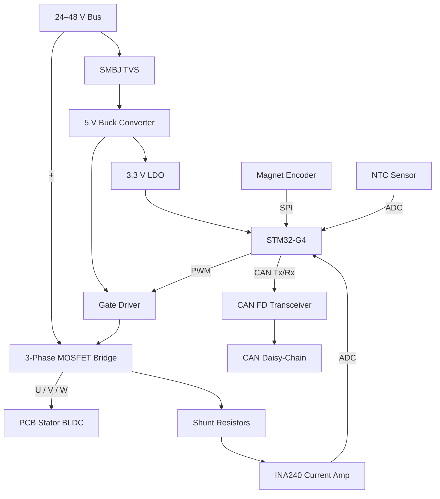

# 🐸 RANA Actuator Family Spec Sheet

**Robotic Actuator for Nimble Applications**
Modular, flange-mounted BLDC actuators with integrated gearing and through-bore, designed for scalable humanoid and mobile robotics.

---

## 🔤 Naming Scheme

| Model       | Size Class | Use Case                                 |
| ----------- | ---------- | ---------------------------------------- |
| **RANA‑S**  | Small      | Wrists, fingers, pan-tilt, grippers      |
| **RANA‑M**  | Medium     | Elbows, shoulders, light-duty joints     |
| **RANA‑L**  | Large      | Load-bearing limbs, spines, mobile bases |
| **RANA‑XL** | X-Large    | Exosuits, logistics arms, chassis drives |

---

## ⚙️ Mechanical Specifications

| Spec                  | RANA‑S   | RANA‑M   | RANA‑L    | RANA‑XL (planned) |
| --------------------- | -------- | -------- | --------- | ----------------- |
| Outer Diameter (mm)   | 60       | 80       | 100       | 130–150           |
| Actuator Length (mm)  | ~35      | ~45      | ~52       | 65+               |
| Output Torque (Cont.) | 6–8 Nm   | 15–25 Nm | 30–50 Nm  | 60–90+ Nm         |
| Output Torque (Peak)  | 15–20 Nm | 50–60 Nm | 90–120 Nm | 180–250 Nm        |
| Repeatability (°)     | ±0.5°    | ±0.2°    | ±0.1°     | ±0.05°            |
| Speed (max, deg/s)    | ~180°/s  | ~150°/s  | ~120°/s   | ~90°/s            |
| Center Bore (mm ID)   | 10       | 15       | 20        | 25–30             |

> **PCB Stator Impact:** The standard PCB stator design reduces actuator length by ~5 mm (S/M), ~8 mm (L), and ~10 mm (XL) while maintaining outer diameter and torque ratings.

> **Dual-Stack Option:** Adding a second PCB stator increases length by the same amount (i.e., +5 / +8 / +10 mm) and delivers roughly **1.8× continuous and peak torque**. Beyond two stacks, thermal and efficiency penalties rise sharply (see discussion in _Stacking Stators_ section).

---

## 🛠️ Core Architecture

- **Motor Type:** BLDC outrunner with integrated **PCB stator** (multi-layer FR-4)
- **Gearbox:** 100:1 harmonic (printed or commercial SHG/CSG clone)
- **Encoder:** Magnetic absolute (AS5048A, AS5147, or AksIM-2)
- **Housing:**
  - _RANA‑S/M_: CF Nylon or CNC 6061 aluminum
  - _RANA‑L/XL_: CNC 7075 aluminum, optional heatsinking
- **PCB Stator Integration:**
  - Multi-layer PCB replaces traditional copper windings, enabling automated manufacturing
  - Stator assembly press-fits into rear housing; phase leads, temperature sensor, and Hall array are routed internally on the board
  - Reduces axial stack length by ~10 % and mass by 15–25 % compared with traditional copper-wound stators
  - Copper planes provide a direct thermal path to housing for higher continuous torque

---

## 🧩 Interface and Mounting

- **Front/Rear Flanges:** ISO 9409-1 compatible
  - _RANA‑S_: F31
  - _RANA‑M_: F50
  - _RANA‑L_: F63
  - _RANA‑XL_: F80+
- **Connection:** Dual flange with bolt circle and pilot boss for rigid stacking
- **Cable Routing:** Center bore pass-through for CAN bus, power, sensors
- **Daisy Chain:** CAN, 24V/48V, and optional UART via JST SH or GX16-4

---

## 🔌 Electrical / Control

| Parameter          | RANA‑S                                | RANA‑M     | RANA‑L  | RANA‑XL  |
| ------------------ | ------------------------------------- | ---------- | ------- | -------- |
| Voltage            | 12–24 V                               | 24 V       | 24–48 V | 48–60 V  |
| Current (peak)     | ~5 A                                  | ~10 A      | ~20 A   | ~30–40 A |
| Control Interfaces | PWM, SPI, UART, CAN                   | Same       | Same    | Same     |
| FOC Compatibility  | SimpleFOC, VESC, ODrive, custom STM32 | All models |

---

## 🖼️ Reference Schematics

### 📐 PCB Stator Layout (conceptual)

A four-layer FR-4 board forms the stator windings:

- **Layers L1 & L3:** clockwise spiral traces that form the "A" and "C" phase teeth
- **Layers L2 & L4:** counter-clockwise spirals for the "B" phase and solid copper ground/thermal planes
- **Slot count:** 12 stator slots / 14-pole rotor for optimal torque density
- **Trace geometry:** 0.25 mm width / 0.25 mm spacing (1 oz Cu) with stitched vias at every 45° sector
- **Sensors on-board:**
  - Hall-array for rotor position (optional redundancy to magnetic encoder)
  - 100 kΩ NTC for stator temperature
  - Differential current-sense shunts near phase leads
- **Connector:** Edge-mount board-to-board mezzanine tying into the power/logic stack

```
Top view (not to scale, ASCII):

        ┌───────────────Ø60/80/100───────────────┐
        │  N S N S N S  Rotor magnet ring  ...   │
        │                                        │
        │   @@@   Spiral phase A (L1)            │
        │  @   @  Spiral phase B (L2)            │
        │   @@@   Spiral phase C (L3)            │
        │        (Ground plane L4 beneath)       │
        └────────────────────────────────────────┘
```

### 🗺️ RANA Electronics / Signal Flow



### ⚡ Simplified Circuit Diagram



---

## 🧠 Smart Features

- **Dual-loop support:** Motor + output encoder
- **Torque estimation:** Via back-EMF or inline current sensor
- **Temperature feedback:** NTC or digital sensor embedded in stator
- **Modular Molecule Support:** Molecule-ready flanges, brackets, and heat dissipation for multi-axis units

---

## 🔧 Assembly Options

| Component           | RANA‑S   | RANA‑M   | RANA‑L | RANA‑XL |
| ------------------- | -------- | -------- | ------ | ------- |
| Inter-axis brackets | ✔︎       | ✔︎       | ✔︎     | ✔︎      |
| Tool mount adapters | ✔︎       | ✔︎       | ✔︎     | ✔︎      |
| Rotary passthroughs | Optional | ✔︎       | ✔︎     | ✔︎      |
| Quick‑swap flanges  | Optional | Optional | ✔︎     | ✔︎      |

---

## 💰 Estimated Unit Cost

Approximate manufacturing cost per actuator, assuming custom PCB stator, integrated electronics, and harmonic gearbox. Prototype pricing reflects low-volume machine shop + PCB fab quotes; batch pricing assumes 50-unit run with modest volume discounts.

| Size           | Prototype (qty 1) | Small Batch (qty 50) |
| -------------- | ----------------- | -------------------- |
| RANA-S         | **~$180**         | **~$95**             |
| RANA-M         | **~$260**         | **~$140**            |
| RANA-L         | **~$420**         | **~$230**            |
| RANA-XL (est.) | **~$680**         | **~$380**            |

> **Cost Drivers:** PCB copper weight (4–6 oz), harmonic gear, NdFeB magnet ring, and CNC housing account for ~70 % of BOM. Electronics and assembly make up the rest. Figures exclude NRE/tooling and regulatory compliance testing.

---

## 💡 Example Applications

| Task                             | RANA‑S | RANA‑M | RANA‑L | RANA‑XL |
| -------------------------------- | ------ | ------ | ------ | ------- |
| Gripper or wrist motion          | ✔︎     |        |        |         |
| Humanoid elbow or shoulder       |        | ✔︎     | ✔︎     |         |
| Mobile base or spine segment     |        | ✔︎     | ✔︎     | ✔︎      |
| Industrial tool use (e.g. drill) |        | ✔︎     | ✔︎     | ✔︎      |
| Payload (max, kg at 60 cm reach) | ~0.5   | ~1.5   | ~3–5   | ~10–15  |
